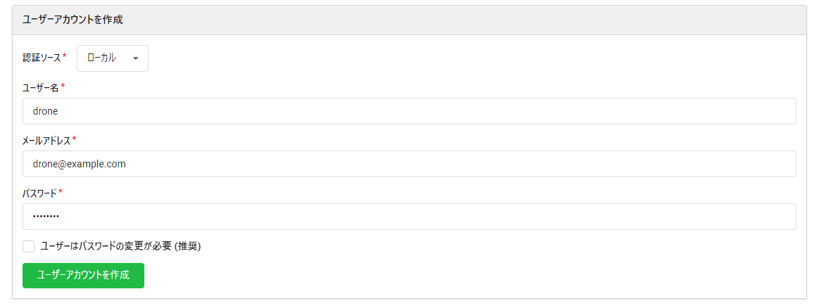
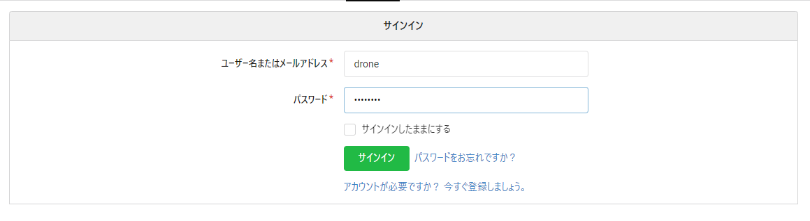
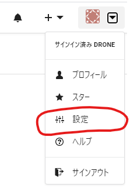
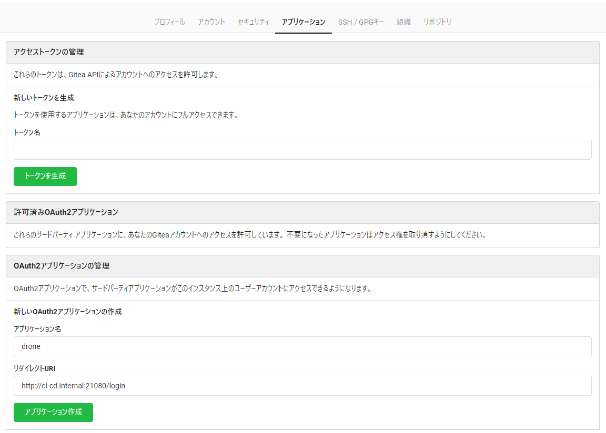
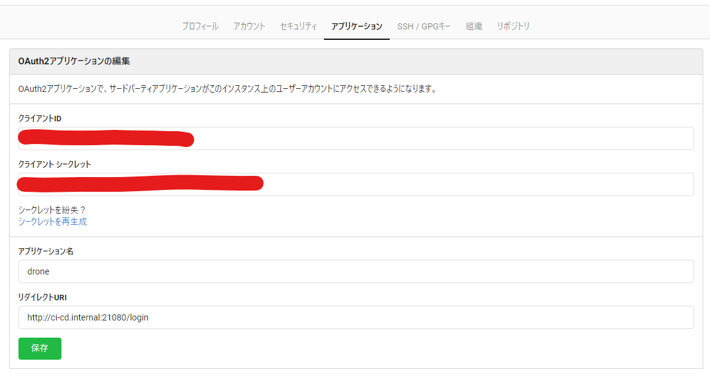
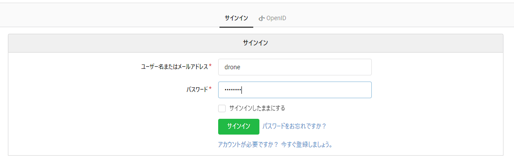
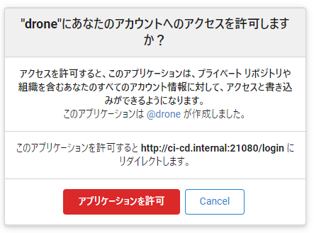
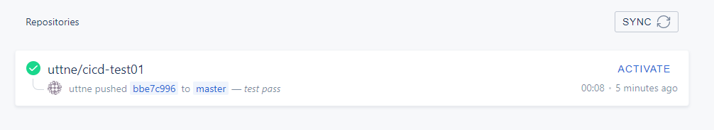
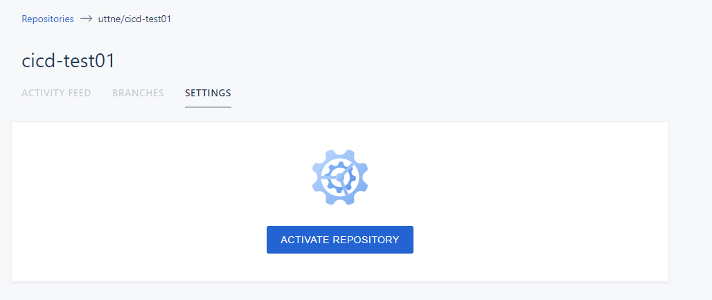
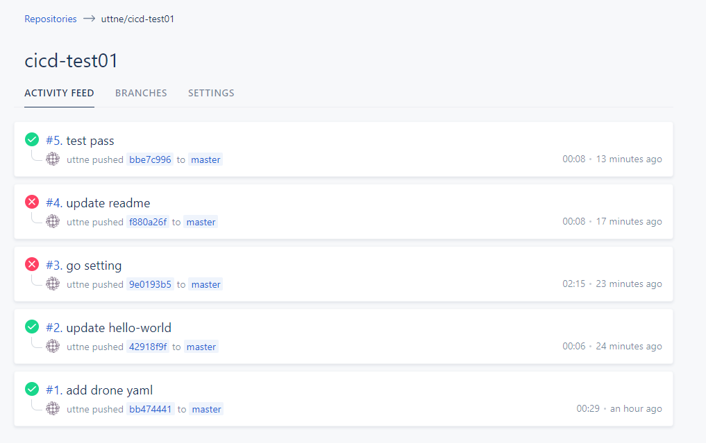

# Drone.io

## 準備

### Host マシンの hosts を編集

docker を動かしている Host マシンの hosts に以下を追加する

```hosts
# 192.168.X.XXX is host machine ip
192.168.X.XXX ci-cd.internal
```

### Host マシンの環境変数を設定する

docker を動かしている Host マシンの環境変数に以下を追加する

| 変数         | 値            | 説明             |
| ------------ | ------------- | ---------------- |
| CICD_HOST_IP | 192.168.X.XXX | ホストマシンのIP |

## Gitea との連携

* [マニュアル](https://docs.drone.io/server/provider/gitea/)

### docker の Host に以下の環境変数を設定する

* DRONE_GITEA_CLIENT_ID
  * Gitea に Drone.io がアクセスするためのクライアントのID
  1. Gitea で drone 用のユーザーを作成する


  2. 作成したユーザーでログインする


  3. 設定をクリックする


  4. OAuth Application を作成する


  5. OAuth Application のクライアントIDを DRONE_GITEA_CLIENT_ID に設定する


* DRONE_GITEA_CLIENT_SECRET
  * Gitea に Drone.io がアクセスするためのクライアントシークレット
  * 同様に作成された OAuth Application のクライアントシークレットを DRONE_GITEA_CLIENT_SECRET に設定する

* DRONE_RPC_SECRET
  * Runner と連携するためのシークレット
  * 以下のコマンドを実行した結果を DRONE_RPC_SECRET に設定する

  ```bash
  openssl rand -hex 16
  ```

  * 実行するときは以下のようなオンラインで Unix コマンドを実行できるサイトを使用すると便利
    * [Compile Bash Online - Run Bash Online](https://www.tutorialspoint.com/execute_bash_online.php)

### Gitea と接続する

Gitea に作成したアカウントと連携をする処理を行う

1. [http://ci-cd.internal:21080](http://ci-cd.internal:21080) にアクセスする
2. [http://ci-cd.internal:20080/user/login](http://ci-cd.internal:20080/user/login) にリダイレクトされるので作成した Drone.io との連携ユーザーでログインする

  作成した OAuth Application を作成したユーザーでログインをしているとこの画面はスキップされる

3. アクセス権の許可ダイアログが出るので許可を行う


### Drone の有効化

1. Gitea で適当なリポジトリを作成する
2. [http://ci-cd.internal:21080](http://ci-cd.internal:21080) にアクセスすると連携したユーザーが持っているレポジトリ―が表示される


3. `ACTIVATE` をクリックし `ACTIVATE REPOSITORY` でリポジトリが更新されたときに CI パイプラインが実行されるようにする


## 実行

### CI パイプラインを実行する

1. Drone ドキュメントの [Quick Start](https://docs.drone.io/quickstart/docker/) を参考に `.drone.yml` を作成しリポジトリにコミットする
2. CI パイプラインが実行される


## 注意事項

### Windows での Drone Runner

現状の自分の Windows では設定が悪いのか Docker のパイプラインを有効にすることができなかったため Hyper-V に Ubuntu をインストールし、そちらで Docker の Runner を実行した。

* [Install On Windows | Drone](https://docs.drone.io/runner/docker/installation/windows/)
* [dockerd | Docker Documentation](https://docs.docker.com/engine/reference/commandline/dockerd/)
  * このオプションをうまく設定することでパイプラインを設定することが可能かも?
